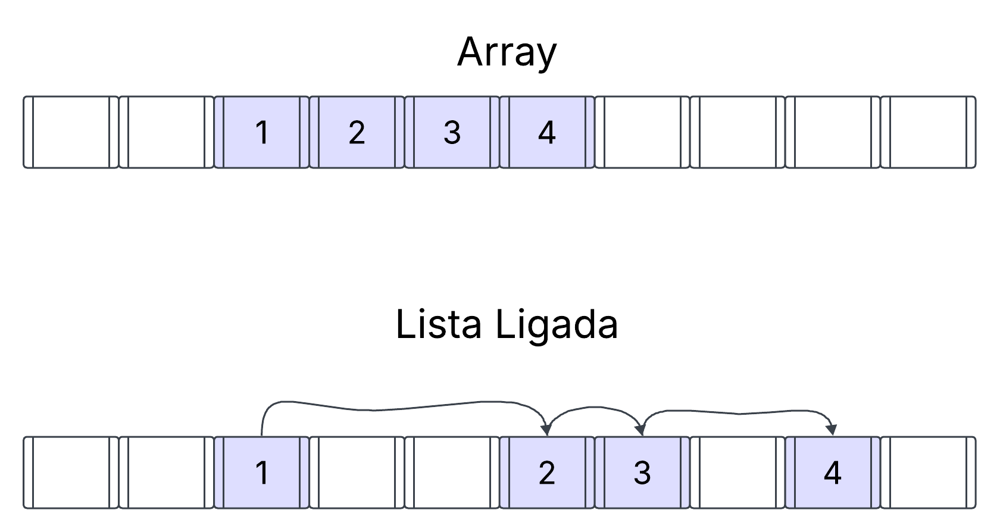
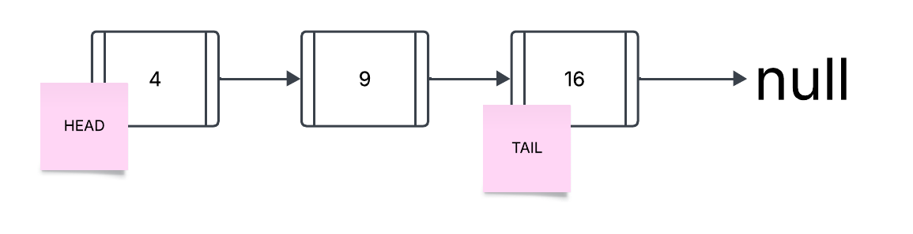
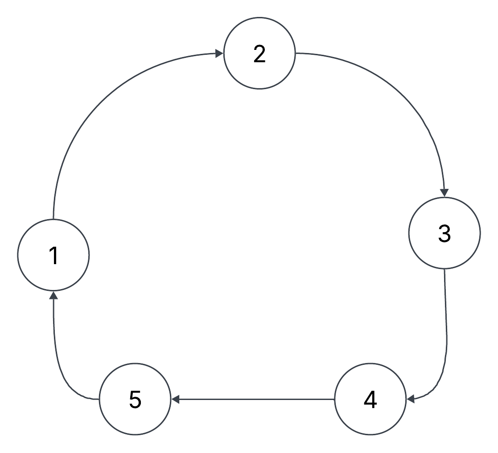
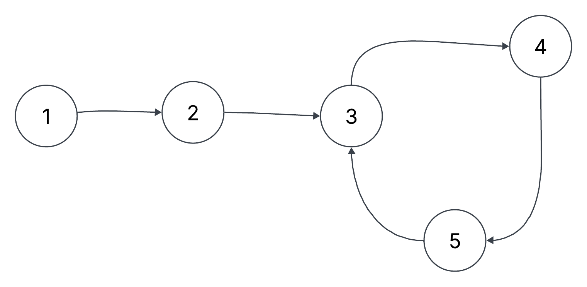

# GUIA DE ESTUDO: Listas Simplesmente Ligadas em PHP com 10 exercícios do LeetCode

Listas ligadas são uma das estruturas de dados mais básicas e fundamentais da programação.
Através delas, podemos modelar e resolver uma série de problemas complexos em código. 
Além disso, elas servem de base para outras estruturas, como Pilhas, Filas, Grafos, etc.

Nesse artigo, mostrarei como você pode estudar esse tópico através de 10 exercícios selecionados do LeetCode.

## Sumário

1. Introdução
2. Operações básicas
3. Detecção de ciclos
4. Rotação de lista
5. Inversão de lista
6. Implementando uma lista com todas essas operações
7. Utilizando a interface Iterator na lista
8. Classes SPL

## 1. Introdução

Uma lista ligada é composta por nós que estão encadeados entre si. 
Ela se assemelha bastante com arrays, mas possui uma diferença fundamental.

Enquanto nos arrays, os elementos são alocados num espaço contínuo na memória, na lista os elementos não estão necessariamente em posições sequenciais.



Por isso, a lista não permite acesso randômico.
Ou seja, para encontrar qualquer dado na lista, a princípio, é necessário percorrer ela por inteiro, de forma sequencial.

Enquanto no array podemos acessar qualquer elemento com um **complexidade de O(1)**, na lista essa operação passa a ter **complexidade O(n)**;

Mas por outro lado, essa estrutura apresenta algumas vantagens, como por exemplo:
- uso flexível da memória (não é necessário alocar um grande espaço sequencial na RAM)
- inserção e remoção mais eficientes: nos arrays é necessário deslocar todos os elementos a partir da posição em que você deseja inserir ou remover um elemento. Na lista basta alterar as refêrencias entre os nós. 
- tamanho dinâmico: você não precisa se preocupar em definir e gerenciar o tamanho de uma lista. Essa característica pode não parecer ser tão relevante no PHP, visto que os arrays do PHP são dinâmicos por natureza. 
Mas a verdade é que o array do PHP não é bem um array e sim um mapa ordenado. Mas isso é assunto para outro momento.



Cada nó de uma lista é composto por duas partes: 
1. Dados
2. Ponteiro para o próximo nó.

As listas ligadas possuem 2 nós especiais: a cabeça e a calda.

- A cabeça(head) é o primeiro nó da lista. A partir dele, podemos percorrer toda a lista e executar as operações.
- A calda(tail) é o último nó da lista. 
  - Normalmente o seu ponteiro aponta para `null` e com isso, sabemos que a lista termina aqui. 
  - Mas existe um caso especial, que é da lista circular, onde a calda aponta para outro nó da lista, formando um ciclo. 

E por fim as listas podem ser divididas em:
- Simplesmente ligadas
- Duplamente ligadas

Nesse artigo, focarei exclusivamente nas **listas simplesmente ligadas**. 

## 2. Operações básicas

```md
rascunho:

2.1 Procurar um nó
2.2. Inserir um nó no início da lista
2.3 Inserir um nó antes de um nó específico
2.4 Inserir um nó depois de um nó específico
2.5 Remover o primeiro nó
2.6 Remover o último nó
2.7 Remover um nó específico
2.8 Encontrar o enésimo(Nº) nó

```

### 2.1 Procurar um nó

Para buscar um nó na lista, basta atribuir a cabeça da lista a uma variável e iterar essa variável através do seu ponteiro até atingir a calda.

```php
class Node {
    public $data;
    public $next;
}

class LinkedList {
    private ?Node $head;
    
    // ...
    
    function search($value): ?Node {
      $current = $this->head;
      
      while ($current) { // Executa enquanto o nó $current existir. Para de executar se ele se tornar nulo.
          if ($value === $current->data) return $current; 
          // Faça algo
          $current = $current->next; // Avança para o próximo elemento da lista
      }
      
      return null;
    }
}
```

**Complexidade**: O(n)

Podemos ver que a princípio, não é possível acessar qualquer elemento da lista de forma direta, igual acontece no array. 
Ou seja, não existe acesso randômico. 

Então para acessar um elemento específico, temos que percorrer toda a lista no pior caso. 
Por conta disso, toda leitura feita na lista tem complexidade de execução de O(n).

### 2.2 Adicionar nó no início da lista

Para adicionar um nó no início da lista, devemos primeiro verificar se já existe um nó no início ou não. 
Caso não exista, apenas atribuímos o novo nó ao início. 
Mas caso exista, então é necessário fazer o novo nó apontar para a antiga cabeça da lista e então fazer a cabeça da lista ser o novo nó. 

O trecho de código abaixo mostra um exemplo:

```php
class LinkedList {
    // ...
    public function addAtHead($value)
    {
        if ($this->head === null) {
            $this->head = new Node($value); // A cabeça da lista está vazia, então o nó é criado e atribuído à cabeça
        } else {
            $node = new Node($value, $this->head); // O novo nó será a nova cabeça da lista. Por isso o seu `next` deve apontar para a cabeça atual  
            $this->head = $node; // A cabeça da lista é trocada
        }
    }
}
```

**Complexidade: O(1)**

Aqui começamos a entender uma vantagem da lista em relação ao array: inserir um elemento na primeira posição da lista é muito rápido. 
Num array seria necessário deslocar todos os outros elementos uma posição à direita, o que implicaria numa complexidade de O(n) para inserir um elemento no início do array.

Por outro lado, para inserir um elemento na calda da lista, a complexidade é de O(n), enquanto no array é de O(1).


### 2.3 Inserir um nó antes de um nó específico 

Para adicionar um nó antes de outro específico, precisamos encontrar o nó anterior e trocar a referência dele para apontar para o novo nó.

```php
public function addBefore($value, $searchValue)
{
    $node = new Node($value);

    if ($this->head->value === $searchValue) { // Caso especial para quando o nó deve ser inserido antes do início da lista
        $node->next = $this->head;
        $this->head = $node;

        return;
    }

    $current = $this->head;
    $previous = null;

    while ($current) {
        if ($current->value === $searchValue) {
            $node->next = $current; // O novo nó apontará para o nó atual
            $previous->next = $node; // E o nó anterior aponta para o novo nó

            return;
        }

        $previous = $current;
        $current = $current->next;
    }
}
```

**Complexidade: O(n)**

No pior caso, a lista inteira tem que ser percorrida para encontrar o nó certo e fazer a inserção. 

### 2.4 Inserir um nó depois de um nó específico


Para inserir um nó depois, não é muito diferente da lógica de inserir um nó antes: devemos encontrar o nó e trocar a referência dele para apontar para o novo nó. 
E o novo nó deve apontar para o antigo `next` de seu predecessor. 

```php
public function addAfter($value, $searchValue)    {
    $node = new Node($value);
    $current = $this->head;

    while ($current) {
        if ($current->value === $searchValue) {
            $node->next = $current->next;
            $current->next = $node;

            return;
        }

        $current = $current->next;
    }
}
```

**Complexidade: O(n)**

Da mesma forma, no pior caso, a lista inteira tem que ser percorrida para encontrar o nó certo e fazer a inserção.

### 2.5 Remover o primeiro nó

Para remover o primeiro nó da lista, basta mover a cabeça da lista para um nó adiante. 

```php
public function removeAtHead()
{
    $this->head = $this->head->next;
}
```

### 2.6 Remover o último nó

Para remover o último nó da lista, devemos percorrê-la e fazer o penúltimo nó apontar para null.

```php
public function removeAtTail()
{
    $current = $this->head;

    while ($current) {
        if ($current->next === null) {
            $prev->next = null;
            $this->tail = $prev;
            break;
        }

        $prev = $current;
        $current = $current->next;
    }
}
```

### 2.7 Remover um nó específico da lista

Para remover o nó da lista, percorremos a lista, pegamos o nó anterior e alteramos o `next` dele para apontar para o `next` do nó a ser removido.
Dessa forma, o nó deixa de ser referenciado na lista e não faz mais parte dela. 

```php
    public function removeAtIndex($index)
    {
        $current = $this->head;
        $prev = null;
        $count = 0;

        while ($current) {
            if ($count === $index) {
                if ($prev === null) {                 
                    $this->head = $this->head->next; // Remove a cabeça da lista
                } else {
                    $prev->next = $current->next; // Remove qualquer outro nó
                }

                break;
            }

            $count++;
            $prev = $current;
            $current = $current->next;
        }
    }
```

Exercícios:

- [Leetcode 707: Design Linked List](https://leetcode.com/problems/design-linked-list/description/)
- [Leetcode 234: Palindrome Linked List](https://leetcode.com/problems/palindrome-linked-list/description/)
- [Leetcode 328: Odd Even Linked List](https://leetcode.com/problems/odd-even-linked-list/description/)
- [Leetcode 19: Remove Nth Node From End of List](https://leetcode.com/problems/remove-nth-node-from-end-of-list/description/)
- [Leetcode 203: Remove Linked Lists Elements](https://leetcode.com/problems/remove-linked-list-elements/description/)

## 3. Detecção de ciclos

Uma lista é definida como circular caso sua calda aponte para outro nó da lista.



Uma lista pode tanto ser totalmente circular como ter apenas um segmento circular.  



### 3.1 Detecção de ciclos com Algoritmo de Floyd

O algoritmo de Floyd utiliza a abordagem de dois ponteiros para resolver esse problema.
Também conhecido como, "A Lebre e a Tartaruga", nesse algoritmo, percorremos a lista iterando dois ponteiros ao mesmo tempo:
  - Um ponteiro mais rápido, conhecido como `fast`, que avança de dois em dois nós
  - Um ponteiro mais lento, conhecido como `slow`, que avança de um em um nó. 

Se o ponteiro mais rápido alcançar o estado `null`, isso significa que a lista tem fim e, portanto, não é circular. 
Mas caso o ponteiro mais rápido nunca fique `null`, é porque ele está preso num ciclo. 
Por conta disso que avançamos também o ponteiro mais lento. 
Caso os dois eventualmente voltem a se encontrar, é porque a lista possui um ciclo. 

```php
public function hasCycle(): bool
{
    $fast = $slow = $this->head;

    while ($fast && $fast->next) {
        $slow = $slow->next;
        $fast = $fast->next->next;

        if ($slow === $fast) return true;
    }

    return false;
}
```

### 3.2 Detecção de ciclos com Algoritmo de Brent

O algoritmo de Brent também utiliza a abordagem de dois ponteiros, mas segue uma lógica diferente. 
Nele mantemos o ponteiro lento parado e interamos o ponteiro rápido. 
Também registramos o número de nós percorridos.
Cada vez que o número de nós percorridos for igual a uma potência de 2, nós movemos o ponteiro lento para a posição do ponteiro rápido.
O começo do ciclo será determinado na menor potência de 2 em que os dois ponteiros se encontrarem. 

```php
public function hasCycleBrent()
{
    $fast = $slow = $this->head;
    if (!$fast || !$fast->next) return false;

    $length = 1;
    $power = 1;
    $fast = $fast->next;

    while($fast && $fast !== $slow) {
        if ($power === $length) {
            $power *= 2;
            $length = 0;
            $slow = $fast;
        }

        $fast = $fast->next;
        $length++;
    }

    if ($fast === null) return false;
    else return true;
}
```

O algoritmo de Brent é um mais complexo de se implementar, porém ele permite encontrar o início do ciclo com certa facilidade.
Para isso, devemos resetar tanto o ponteiro fast como o slot e movimentar o fast pelo tamanho do length, ou seja, o fast vai andar a partir do início da lista pela quantidade de nós equivalente ao tamanho do ciclo.
Aí, com o fast posicionado dentro do ciclo e o slow posicionado no início da lista, nós percorremos a lista novamente, iterando cada ponteiro um a um e aí, no momento em que eles se encontrarem, será no início da lista.  

```php
public function hasCycleBrent()
{
    $fast = $slow = $this->head;
    if (!$fast || !$fast->next) return false;

    $length = 1;
    $power = 1;
    $fast = $fast->next;

    while($fast && $fast !== $slow) {
        if ($power === $length) {
            $power *= 2;
            $length = 0;
            $slow = $fast;
        }

        $fast = $fast->next;
        $length++;
    }

    if ($fast === null) return false;
    
    $slow = $fast = $this->head;

    while ($length > 0) {
        $fast = $fast->next;
        $length--;
    }

    while ($fast !== $slow) {
        $fast = $fast->next;
        $slow = $slow->next;
    }
    
    return $slow;
}
```

**Complexidade: O(n + m)**, onde m é a distância até o início do ciclo e n é o tamanho do ciclo. 

### Mediana da lista

É possível adaptar o algoritmo de Floyd para encontrar o nó posicionado no meio de uma lista.
A ideia é simples: se o fast anda de 2 em 2 nós, e o slow anda de 1 em 1 nó, então quando o fast alcançar o final da lista, podemos dizer que o slow ainda estará na metade da mesma. 

```php
public function getMiddleNode()
{
    $fast = $slow = $this->head;

    while ($fast && $fast->next) {
        $slow = $slow->next;
        $fast = $fast->next->next;
    }

    return $slow;
}
```

**Complexidade: O(n/2)**: onde n é o tamanho da lista. 

Exercícios:
- Leetcode 141: Linked List Cycle
- Leetcode 142: Linked List Cycle II
- Leetcode 876: Middle of Linked List
- Leetcode 2095: Delete the Middle Node of a Linked List

## 5. Rotação de listas

A rotação de uma lista pode ser feita de duas formas: 
- Modificando o início da lista
- Convertendo a lista numa lista circular, alterando a cabeça dessa lista e depois convertendo novamente a lista circular numa lista normal.

### 5.1 Abordagem ingênua

A primeira abordagem, de modificar o início da lista é a mais simples:
- Para rotacionar à direita, basta remover o nó da calda e inserí-lo na cabeça. 
- Para rotacionar à esquerda, o contrário se aplica: basta remover o nó da cabeça e inserí-lo na calda.

```php
public function rotateRight()
{
    $this->addAtHead($this->tail->value);
    $this->removeAtTail();
}

public function rotateLeft()
{
    $this->addAtTail($this->head->value);
    $this->removeAtHead();
}
```

**Complexidade O(n * k)**: onde n é o tamanho da lista e k é o número de vezes em que a operação de rotação é executada. 

Essa abordagem funciona muito bem se você precisa rotacionar a lista poucas vezes. O problema existe quando você precisa rotacioná-la diversas vezes.

### Truque de K % n: como lidar com um número muito grande de rotações?

Suponha que uma lista tem 3 elementos e você precisa rotacionar ela à direita 4 vezes.

Se você rotaciona a lista 3 vezes, você volta os elementos para a posição original.

```txt
lista original: 1 -> 2 -> 3
1ª rotação: 2 -> 3 -> 1
2ª rotação: 3 -> 2 -> 1
3ª rotação: 1 -> 2 -> 3
```

Rotacionar ela 4 vezes seria equivalente a rotacionar ela apenas uma vez. 
Ou seja, o número realmente necessário de rotações, pode ser contabilizado por: 
- R = N % K, onde N é o número de nós na lista, K é o número de rotações desejadas e R é o número de rotações necessárias.

### 5.1 Abordagem circular

Já a segunda abordagem, consiste em converter a lista numa lista circular e atravessar ela lista circular até encontrar o nó de número K.
Assim que esse nó for encontrado, nós atualizamos a cabeça da lista para o nó de número K + 1 quebramos o loop ao alterar o `next` de K para null


```php
public function rotateRightMany(int $k)
{
    if ($k == 0 || $this->head === null) return $this->head;

    $current = $this->head;
    $length = 1;

    while ($current && $current->next) {
        $current = $current->next;
        $length++;
    }

    $k %= $length;
    if ($k == 0) return $this->head;

    $current->next = $this->head;
    $current = $this->head;

    for ($i = 1; $i < $k; $i++) {
        $current = $current->next;
    }

    $this->head = $current->next;
    $current->next = null;
}
```  

- Exercícios:
- [Leetcode 61: Rotate Linked List](https://leetcode.com/problems/rotate-list/description/)


## 6. Inversão de listas

Para inverter uma lista, nós percorremos ela e reorganizamos os ponteiros `next` para apontar do início até o fim da lista.
Definiremos uma variável `$prev` que vai ter o papel de armazenar os nós da lista com o `next` invertido. 
Ela começa com o valor nulo, e a cada iteração na lista, ela armazena o valor do nó atual, mas com o ponteiro  `next` apontando para o nó oposto. 

No código abaixo, é possivel visualizar a lógica da implementação. 

```php
public function reverse()
    {
        $current = $this->head;
        $prev = null;

        while ($current) {
            $next = $current->next; // Armazena o valor de `next` do nó atual, pois o ponteiro de $current será alterado em breve
            $current->next = $prev; // Aponta para o nó oposto
            $prev = $current; // Atualiza o valor de $prev
            $current = $next; // Avança na lista
        }

        $this->head = $prev; // Substitui a cabeça da lista pela cabeça da lista invertida
    }
```

**Complexidade temporal: ** O(n)
- 
- Percorre a lista uma única vez.


Exercícios:
- [Leetcode 206: Reverse Linked List](https://leetcode.com/problems/reverse-linked-list/description/)


## 6. DESAFIO: Implemente uma lista ligada completa, com todas essas operações

Como desafio, implemente uma lista ligada com todas as operações que foram estudadas nesse artigo. 
Essa lista sevirá de base para o próximo item do artigo.

```php
interface ILinkedList
{
    public function add($value);
    public function addAt($value, $index);
    public function addBefore($value, $searchValue);
    public function addAfter($value, $searchValue);
    public function addAtTail($value);
    public function addAtHead($value);
    public function removeAtHead();
    public function removeAtTail();
    public function removeAtIndex($index);
    public function rotateRight();
    public function rotateLeft();
    public function rotateRightMany(int $k);
    public function display();
    public function getMiddleNode();
    public function hasCycle(): bool
    public function hasCycleBrent();
    public function setCycleAt($index): void;
    public function getAt($index);
    public function reverse();
    public function toArray();
}
```

- <<Snippet da lista no github>>


## Extra: Utilizando a interface Iterator na lista

O PHP possui a interface Iterator que pode ser usada para transformar qualquer objeto num tipo iterável.
Assim podemos percorrer esse objeto dentro de um loop `foreach`, por exemplo.
Além disso, podemos controlar a forma como essa iteração ocorre. 

```php
class LinkedList implements ILinkedList, Iterator
{
    private ?Node $current = null;
    private int $currentPosition = 0;

    public function current(): mixed
    {
        return $this->current;
    }

    public function next(): void
    {
        $this->currentPosition++;
        $this->current = $this->current?->next;
    }

    public function key(): mixed
    {
        return $this->currentPosition;
    }

    public function valid(): bool
    {
        return $this->current !== null;
    }

    public function rewind(): void
    {
        $this->currentPosition = 0;
        $this->current = $this->head;
    }
}
```

Após implementar os métodos, a lista passa a ser iterável e podemos utilizá-la nos loops `for` e `foreach`.


```php
foreach ($list as $node) {
    echo "$node->value -> ";
}

for ($list->rewind(); $list->valid(); $list->next()) {
    echo $list->current()->value . " -> ";
}
```

## Próximos passos:

- Listas duplamente ligadas
- Exercícios do LeetCode sobre listas ligadas