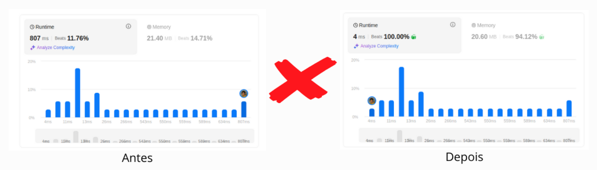
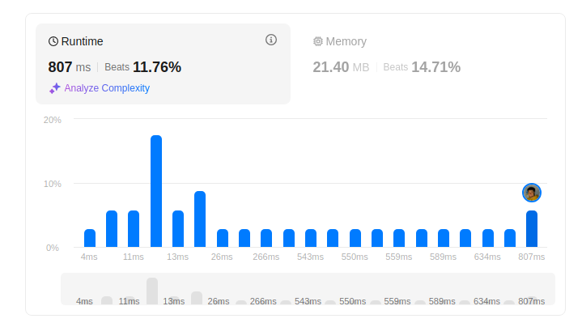
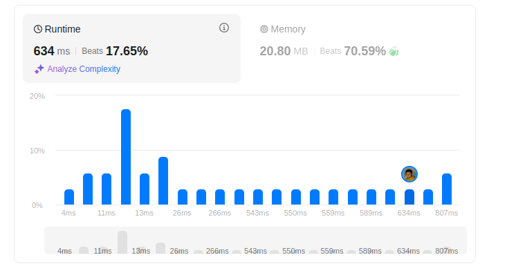
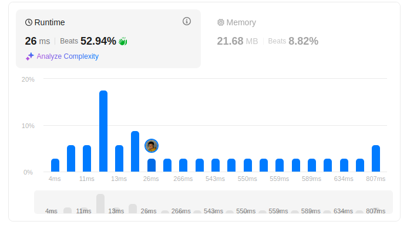
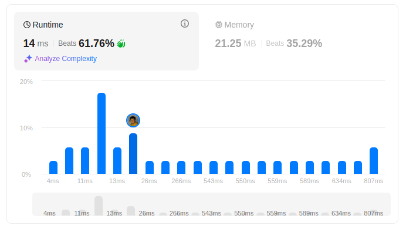
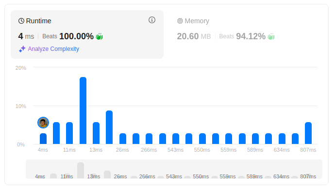

# Queues in PHP: a study case about Leetcode 649: Dota2 Senate

---

# Filas em PHP: um estudo de caso sobre o Leetcode 649 - Dota2 Senate

Neste artigo eu mostrarei o meu processo de raciocínio utilizado para resolver o exercício 649 do Leetcode: Dota2 Senate em PHP.

A primeira vez que eu resolvi esse exercício, a solução foi executada em 803 ms. 
Na última, ela foi aceita em 4ms, um ganho de performance surreal de 99,5% no tempo de execução.

Neste texto eu apresentarei 5 soluções diferentes, melhoradas de forma incremental. 



## Introdução do problema

Neste problema, temos uma eleição de senado que será realizada entre dois partidos e devemos descobrir quem vencerá com base num conjunto muito específico de regras:

- A eleição é feita em turnos, onde cada senador realiza uma ação na sua vez. 
- As ações possíveis são:
  - Retirar os direitos políticos de outro senador: ou seja, impedir outro senador de votar na eleição
  - Anunciar o partido vencedor
- Depois que todos os senadores agirem, a rodada reinicia. 
- Um partido só pode ser anunciado vencedor se sobrarem apenas senadores do mesmo partido.

Assumindo que os senadores sempre tomarão a melhor ação possível na sua vez, ou seja, irão remover os direitos do próximo senador do partido de oposição, o algoritmo deve retornar qual partido venceria a eleição para determinados inputs.
O input é uma simples string representando a lista de senadores e seus partidos. 
Exemplo: "RDDRD", onde R representa o partido _Radiant_ e D o partido _Dire_.

## Análise do problema

A votação é feita de forma sequencial: ou seja, o primeiro senador do input votará primeiro.
Outro fato é que o senador desejará retirar da votação o primeiro senador do partido oposto que estiver na lista, pois essa é a forma mais eficiente de votar. 

É um caso clássico de processamento FIFO - First In First Out, que pode ser resolvido através de filas. 

Além disso, existem diversas rodadas até o vencedor ser encontrado. 
Uma vez que um senador votou, ele é incluído novamente no final da fila, para eventualmente votar de novo, caso a eleição não acabe até lá.

Então podemos ter em mente o conceito de filas circulares para abordar esse problema.

## Abordagens

### 1. Usando operador de array append e a função array_shift()

Antes de nos preocuparmos em implementar uma fila, podemos usar um array e duas funções auxiliares para realizar o comportamento da fila: `array_push()` e `array_shift()`. 

- `array_push`: adiciona um elemento ao final do array. É a mesma coisa que usar o operador de append: `array[] = $data`
- `array_shift`: remove e retorna o primeiro elemento de um array.

A partir dos dados de entrada, criamos 2 arrays `$radiant` e `$dire`, um para cada partido e dentro desse array, adicionaremos seus senadores a partir do input inicial.

```php
function predictPartyVictory($senate) {
    $radiant = $dire = [];    
    $senate = str_split($senate);
    
    foreach ($senate as $key => $senator) {
        if ($senator == 'R') {
            $radiant[] = $key;
        } else if($senator == 'D') {
            $dire[] = $key;
        }
    }
    
    // ...
}
```

Uma vez que os arrays estejam prontos, podemos implementar a lógica de votação. 
Para isso, temos que percorrer a lista de senadores, e verificar se o senador em questão está presente no array do seu partido. 
Se tiver, quer dizer que ele pode votar. Ou seja, quer dizer que ninguém excluiu ele da votação ainda.
Caso o senador vote, também temos que ter em mente que ele deve retornar ao final da fila de seu partido, pois quando a rodada reiniciar, ele votará novamente.

```php
foreach ($senate as $key => $senator) {
    if ($senator == 'R' && in_array($key, $radiant)) {
        array_shift($dire);
        array_shift($radiant);
        $radiant[] = $key;
    }
    if ($senator == 'D' && in_array($key, $dire)) {
        array_shift($radiant);
        array_shift($dire);
        $dire[] = $key;
    }
}
```

O loop do foreach resolve 1 rodada de votação.
Contudo podemos ter várias, por isso esse loop(que representa a rodada) deve entrar dentro de outro loop(que representa a votação inteira). 
E as rodadas serão votadas até algum dos partidos ficar sem nenhum senador.

```php
while(!empty($radiant) && !empty($dire)) {
    foreach ($senate as $key => $senator) {
        if ($senator == 'R' && in_array($key, $radiant)) {
            array_shift($dire);
            array_shift($radiant);
            $radiant[] = $key;
        }
        if ($senator == 'D' && in_array($key, $dire)) {
            array_shift($radiant);
            array_shift($dire);
            $dire[] = $key;
        }
    }
}
```

E por fim, para descobrir o vencedor, basta verificar qual array está vazio. 

```php
if (empty($radiant)) return 'Dire';
return 'Radiant';
```

A implementação final:

```php
function predictPartyVictory($senate) {
    $radiant = [];
    $dire = [];
    $senate = str_split($senate);
    foreach ($senate as $key => $senator) {
        if ($senator == 'R') {
            $radiant[] = $key;
        } else if($senator == 'D') {
            $dire[] = $key;
        }
    }

    while(!empty($radiant) && !empty($dire)) {
        foreach ($senate as $key => $senator) {
            if ($senator == 'R' && in_array($key, $radiant)) {
                array_shift($dire);
                array_shift($radiant);
                $radiant[] = $key;
            }
            if ($senator == 'D' && in_array($key, $dire)) {
                array_shift($radiant);
                array_shift($dire);
                $dire[] = $key;
            }
        }
    }

    if (empty($radiant)) return 'Dire';
    return 'Radiant';
}
```



**Esse algoritmo é muito ruim.**

Temos dois loops aninhados. 
O foreach sempre vai percorrer em tempo de O(N).
O while no pior dos casos, percorre em O(N) também, pois no pior dos casos ele teria que ser executado até `$radiant` ou `$dire` ficar vazio. 

Pra piorar, cada votação verifica se o senador está na lista do seu partido ou não, ou seja, percorre mais uma vez `$radiant` ou `$dire` em tempo O(N). 

E pra piorar o que já estava pior, temos duas operações de `array_shift`, cada uma delas custando O(N), pois o array shift, além de retornar o primeiro elemento do array, também reindexa ele. 
Então o método precisa percorrer todos os elementos do array novamente. 

Além disso, temos que lembrar o seguinte: 
- Sendo R, o tamanho do partido Radiant
- E sendo D, o tamanho do partido Dire.
- E sendo N, o tamanho total do input.
- É seguro dizer que N = R + D

Então temos:
- uma complexidade de O(R) + O(D) no while, 
- uma complexidade de O(N) no foreach, 
- uma complexidade de O(R) + O(D) nos ifs, visto que o input sempre será ou R ou D, ou seja, a verificação do in_array sempre será feita
- uma complexidade de O(R) + O(D) dentro de cada if, para executar o array_shift

O(R + D) * O(N) * O(R + D) * O(R + D) = O(N⁴)
Temos no total uma complexidade **TENEBROSA** de O(N⁴).

Por conta disso, esse algoritmo teve tempo de execução na casa de 800ms, enquanto as melhores soluções no Leetcode rodam em menos de 10ms.

Vamos entender como melhorar esse algoritmo. 

# 2. Usando arrays, mas melhorando a validação do senador

Ainda mantendo o mesmo algoritmo de antes, podemos analisá-lo para encontrar pontos de melhora. 


Se estamos simulando uma fila através do array e dos operadores que utilizamos, então podemos entender que o primeiro elemento de cada fila é o próximo senador a votar.
E o último elemento de cada fila, será o último senador a votar.

Com isso em mente, dá pra descartar a necessidade de olhar todo o array do partido para verificar se o senador em questão é válido ou não. 
Ou seja, o terceiro loop aninhado, executado dentro do in_array pode ser excluído do algoritmo.

Podemos olhar apenas o primeiro senador de cada partido e se o senador em questão for o primeiro da fila do partido, quer dizer que ele pode votar e que está na vez dele.


```php
foreach ($senate as $key => $senator) {
    if ($senator == 'R' && $radiant[0] === $key) {
        array_shift($dire);
        array_shift($radiant);
        $radiant[] = $key;
    }
    if ($senator == 'D' && $dire[0] === $key) {
        array_shift($radiant);
        array_shift($dire);
        $dire[] = $key;
    }
}
```

Para casos onde o array tem chaves numéricas, o `array_shift` [reorganiza as chaves e começa contando do zero.](https://www.php.net/manual/en/function.array-shift.php)
Então podemos confiar que o elemento de índice zero sempre será o primeiro elemento da fila. 

```php
function predictPartyVictory($senate) {
    $radiant = [];
    $dire = [];
    $senate = str_split($senate);
    foreach ($senate as $key => $senator) {
        if ($senator == 'R') {
            $radiant[] = $key;
        } else if($senator == 'D') {
            $dire[] = $key;
        }
    }

    while(!empty($radiant) && !empty($dire)) {
        foreach ($senate as $key => $senator) {
            if ($senator == 'R' && $radiant[0] === $key) {
                array_shift($dire);
                array_shift($radiant);
                $radiant[] = $key;
            }
            if ($senator == 'D' && $dire[0] === $key) {
                array_shift($radiant);
                array_shift($dire);
                $dire[] = $key;
            }
        }

    }

    if (empty($radiant)) return 'Dire';
    return 'Radiant';
}
```



Com isso, removemos o loop mais interno e a complexidade que era O(N⁴), se torna O(N³).
Podemos notar a melhora analisando o tempo de execução que caiu da casa dos 800ms, para 600ms. 

Melhoramos o algoritmo, mas ele ainda continua muito ruim. 
Vamos melhorar ainda mais. 

## 3. Descartando array_shift e Usando a SPL Queue

**O `array_shift` é caro.**

Além de retirar o primeiro elemento, ele re-indexa o array, e para fazer isso, ele precisa percorrer todo o array. 

Ele pode ser um grande quebra-galho em situações onde você precisa manipular array e possui pequenos conjuntos de dados. 
Mas nesse caso, ele está nos custando caro. 

Podemos substituir a abordagem de usar arrays para usar uma fila de verdade.
E nisso entra a SplQueue do PHP.

SPL é a Standard PHP Library.
Um conjunto de classes e interfaces nativas que resolvem problemas comuns, como estruturas de dados, iteradores, exceções, manipulação de arquivos, etc. 

Para manipular filas, existe a classe [SplQueue](https://www.php.net/manual/pt_BR/class.splqueue.php. 

Vamos refatorar o código do passo 2 para usar a nova estrutura:

```php
function predictPartyVictory($senate) {
    $radiant = new SplQueue();
    $dire = new SplQueue();    
    // ...
}
```

Agora `$radiant` e `$dire` terão acesso aos métodos `enqueue()`, `dequeue()`, `top()` e `bottom()`.
O `dequeue()` em especial vai permitir a operação de remover o primeiro elemento da fila em O(1); muito mais rápido que o `array_shift()` que roda em O(N).

```php
function predictPartyVictory($senate) {
    $radiant = new SplQueue();
    $dire = new SplQueue();

    $senate = str_split($senate);

    foreach ($senate as $key => $senator) {
        if ($senator == 'R') {
            $radiant->enqueue($key);
        } else if($senator == 'D') {
            $dire->enqueue($key);
        }
    }

    while(!$radiant->isEmpty() && !$dire->isEmpty()) {
        foreach ($senate as $key => $senator) {
            if ($dire->isEmpty() || $radiant->isEmpty()) break;

            if ($senator == 'R' && $key === $radiant->bottom()) {
                if (!$dire->isEmpty()) $dire->dequeue();
                $radiant->dequeue();
                $radiant->enqueue($key);
            }
            if ($senator == 'D' && $key === $dire->bottom()) {
                if (!$radiant->isEmpty()) $radiant->dequeue();
                $dire->dequeue();
                $dire->enqueue($key);
            }
        }
    }

    if ($radiant->isEmpty()) return 'Dire';
    return 'Radiant';
}
```



Com esse algoritmo, reduzimos mais um nível de complexidade e os resultados não nos deixam mentir: **saímos da casa dos 634ms para executar esse código em 26ms.**

Através do uso correto das filas, não temos mais que nos preocupar com a complexidade O(n) de uma operação de remover o primeiro elemento da fila, como era o caso com o uso do array_shift. 

Agora existem apenas 2 loops, que no pior dos cenários vai rodar em O(N²).

Mas ainda existe espaço para melhora: e se usarmos apenas um loop para processar essa votação?

## 4. Usando a SPL Queue, o conceito de filas circulares e um único loop para processar a votação

O algoritmo anterior tem dois loops aninhados porque temos várias rodadas de votação e analisamos todos os senadores em cada rodada, validando os que podem votar.

O problema dessa abordagem é que cada rodada vai avaliar todos os senadores, mesmo aqueles que já não podem mais votar.

É possível otimizar isso. 

E se tirarmos completamente os senadores inválidos do loop?

Para fazer isso, vamos relembrar o seguinte: cada fila de partido guarda o index que o senador tem no array de input.
Podemos olhar apenas para a fila a cada iteração. 
E comparar o index dos senadores: se o index do senador Radiant for menor que o index do senador Dire, então está na hora do senador Radiant votar. E vice-versa
Se está na hora do radiante votar, depois da votação precisa voltar para a fila.
Mas ele não pode voltar para a fila com o mesmo índice, pois isso bagunçaria a votação. 
Ele precisa voltar pra fila com um certo "deslocamento" no valor do seu índice, que pode ser igual ao tamanho da fila.  

```php
function predictPartyVictory($senate) {
    $n = strlen($senate);
    // ...
    
    while(!$radiant->isEmpty() && !$dire->isEmpty()) {
        $r = $radiant->dequeue();
        $d = $dire->dequeue();

        if ($r < $d) {
            $radiant->enqueue($r + $n);
        } else {
            $dire->enqueue($d + $n);
        }
    }
    
    // ..    
}
```

Através dessa lógica:
- a cada iteração os dois senadores concorrentes são removidos de suas filas
- seus indíces são comparados
- o senador com menor índice é adicionado ao final da fila de seu partido com um índice novo, que é igual ao índice atual somado com o número de elementos de entrada.  

O algoritmo no final fica assim:

```php
function predictPartyVictory($senate) {
    $radiant = new SplQueue();
    $dire = new SplQueue();

    $n = strlen($senate);
    $senate = str_split($senate);

    foreach ($senate as $key => $senator) {
        if ($senator == 'R') {
            $radiant->enqueue($key);
        } else if($senator == 'D') {
            $dire->enqueue($key);
        }
    }

    while(!$radiant->isEmpty() && !$dire->isEmpty()) {
        $r = $radiant->dequeue();
        $d = $dire->dequeue();

        if ($r < $d) {
            $radiant->enqueue($r + $n);
        } else {
            $dire->enqueue($d + $n);
        }
    }

    if ($radiant->isEmpty()) return 'Dire';
    return 'Radiant';
}
```



Com um único loop, o algoritmo executa em tempo O(N) e com isso, fica muito mais rápido.
Nesse caso, executou em quase metade do tempo da solução anterior.

Contudo, aqui ainda estamos alocando na memória duas filas auxiliares e manipulando elas.

Será que existe um jeito ainda mais rápido ou pelo menos mais leve para resolver esse problema?

## 5. Abandonando a SplQueue e manipulando strings como filas

Filas são FIFO: First In First Out, o primeiro dado que entra é o primeiro que sai.

Para utilizar o conceito da Fila, não precisamos nos apegar a usar classes nativas como a SplQueue, nem nos apegar a implementações próprias para essas classes. 

Nesse caso, podemos apenas percorrer a string de entrada e re-adicionar ao final desta string, os senadores que votarão novamente. 

O truque é entender como fazer isso. 

Uma flag representará para "qual lado está pendendo a votação".
Ou seja, se os Radiants estiverem com vantagem, essa flag estará positiva, se estiverem em desvantagem, ela estará negativa.
Então, ao percorrer os senadores, se encontrarmos um Radiant, nós incrementamos essa flag.  Se encontrarmos um Dire, nós decrementamos essa flag. 
 
Mas só isso não é suficiente. Precisamos de uma regra para inserir novamente os senadores válidos no final da fila.

Vamos raciocinar: durante o percurso, se você encontra um Radiant e a flag está negativa, podemos entender que até esse momento, apareceram mais senadores Dire do que Radiants, certo?
E vice-versa: se você encontra um Dire e a flag está positiva, então quer dizer que até aquele ponto, existem mais Radiants do que Dire. 

Se o senador atual em questão é Radiant e existem mais Dire do que Radiant na lista antes dele, então sabemos que esse senador Radiant não vai votar, pois um dos senadores Dire que veio antes dele, cassou os seus direitos e impediu seu voto. 
E o mesmo vale para a situação oposta. 

Se isso aconteceu, o Senador Dire que removeu o voto do senador atual, que é Radiant, deve voltar para a fila de votação, pois uma nova rodada se iniciará quando a atual terminar. 

Através desse entendimento, dá pra implementar esse algoritmo elegante:

```php
function predictPartyVictory($senate) {
    $count = 0;

    for ($i = 0; $i < strlen($senate); $i++) {
        if ($senate[$i] == 'R') {
            if ($count < 0) {
                $senate .= 'D';
            }

            $count++;
        } else {
            if ($count > 0) {
                $senate .= 'R';
            }

            $count--;
        }
    }

    if ($count < 0) return 'Dire';
    return 'Radiant';
}
```

Além de rodar em tempo O(N), nós não precisamos criar nenhuma estrutura de dados auxiliar: apenas incrementamos o array de entrada.



E com isso, o algoritmo que inicialmente rodou em 807ms, agora está rodando em apenas 4ms. 
Uma incrível redução de 99,5% no tempo de execução.

## Conclusão

Nem sempre vamos ser capazes de escrever a melhor solução logo de cara e não existe problema nisso. 
Como programadores, devemos abraçar o processo incremental no desenvolvimento de nossas soluções: seja na implementação de simples algoritmos ou de sistemas mais complexos. 
